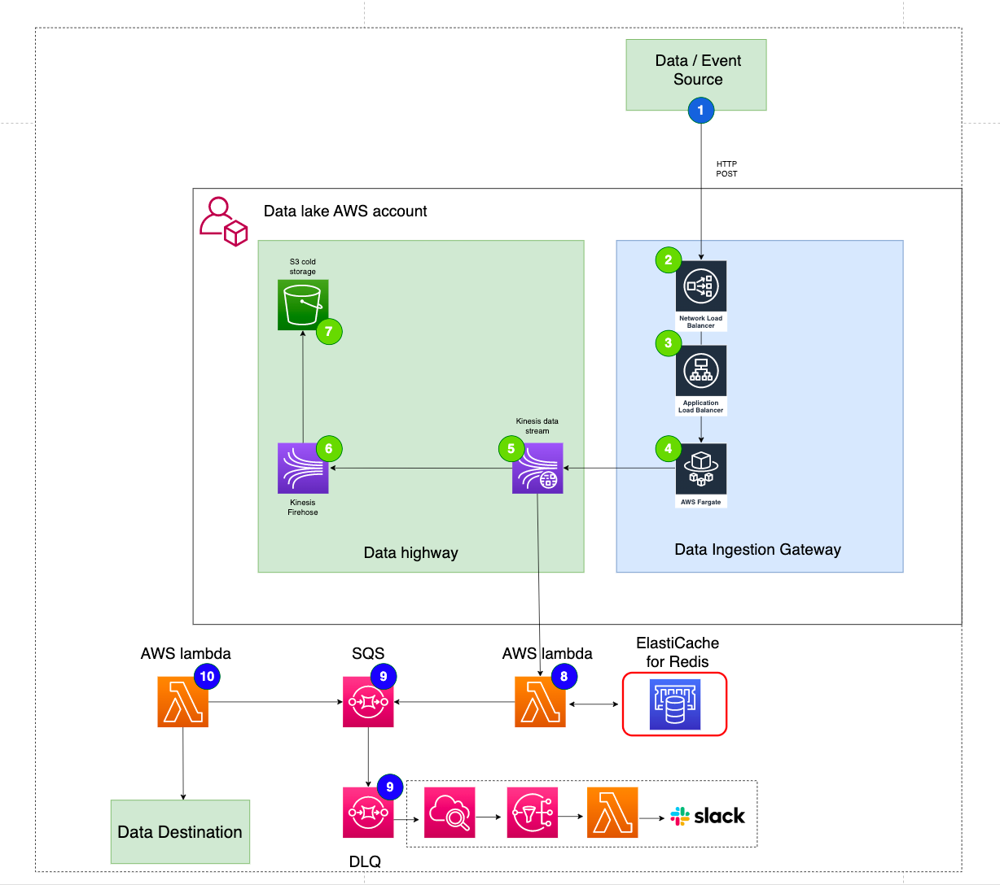

# AWS Lambda

This module creates a set of AWS resources that will pull data from a Kinesis data stream, put it onto an SQS queue and have a Lambda pick up the item and process it.
This module is designed to work with DIG.
The module allows for consumers of the module to supply their own lambda to process the records that are fed into the underlying SQS queue.
This module also supports using a Redis cluster for long term deduplication as FIFO queues only offer a 5 minute dedup window.

The lambdas that consume data from the SQS queue can reside in the same account at the SQS queue but also a different account.
In the case the lambda is in another account, there are two steps that need to be taken. Firstly, The execution role of the lambda will need to include the following permissions.

```
Statement": [
        {
            "Action": [
                "sqs:*"

            ],
            "Effect": "Allow",
            "Resource": ["*"]
        },
        {
            "Action": [
                "kms:Decrypt",
                "kms:ReEncrypt*",
                "kms:GenerateDataKey*",
                "kms:DescribeKey"
            ],
            "Effect": "Allow",
            "Resource": ["*"]
        }
]
```

The resource blocks should be tightened down as you see fit, these can be adjusted to the arn of the SQS queue or can use something like `arn:aws:sqs:*:123456789012:*`.

Secondly, the lambda will need to have a trigger setup to enable the event sourcing using the SQS queue as the source. This can be done using IaC or using the AWS UI. IaC is the preferred choice.



See the above diagram. This module creates the resources numbered 9 and 8.

The consumer supplied lambda is at number 10.

## Providers

| Name        | Version |
| ----------- | ------- |
| aws.kinesis | n/a     |
| aws.sqs     | n/a     |

Two provider aliases must be passed to this module:

- `aws.kinesis` - this should be configured in the same region as the source kinesis stream
- `aws.sqs` - this should be configured in the region you want SQS resources to be created.

The SNS topic specified in the `slack_sns_arn` variable must be in the same region as the `aws.kinesis` provider

**Example config:**

```
provider "aws" {
    region = "us-west-2"
    alias  = "usw2"
}

provider "aws" {
    region = "us-east-1"
    alias  = "use1"
}

module "kinesis_to_sqs" {
    providers = {
        aws.sqs     = aws.usw2
        aws.kinesis = aws.use1
    }

    source = "Adaptavist/kinesis-sqs/aws"
    ...
}
```

## Environment Variables

The lambda supports an optional configuration object for specifying various path filters and Redis hash keys, ideal for creating composite keys for Redis records and filtering through multiple record paths.

**Note:** For dynamic DIG endpoints, it's essential to specify a Redis hash key. Each payload includes unique metadata, preventing the use of the full payload as a unique key.

**Example config:**

```
config = [
  {
    path_value_filter = "/another-path/events/example"
    redis_hash_keys   = ["anotherKey,id", "anotherKey,email"]
  }
  # Add more objects if needed
]

```

## Inputs

| Name                          | Description                                                                                                                                                                                                                                                           | Type           | Default | Required |
| ----------------------------- | --------------------------------------------------------------------------------------------------------------------------------------------------------------------------------------------------------------------------------------------------------------------- | -------------- | ------- | :------: |
| availability_zones            | List of availability zones if in use                                                                                                                                                                                                                                  | `list(string)` | `[]`    |    no    |
| cluster_id                    | The ID / name of the Redis cluster, if in use                                                                                                                                                                                                                         | `string`       | `null`  |    no    |
| enable_cloudwatch_logs        | Should cloudwatch logs be enabled for the lambda modules                                                                                                                                                                                                              | `bool`         | `true`  |    no    |
| is_lambda_local               | Do the attached lambdas reside in the same aws account as the rest of the stack                                                                                                                                                                                       | `bool`         | `true`  |    no    |
| lambda_execution_roles        | List of ARNS of the lambdas execution roles that need to subscribe the SQS queue created by this module. The role can be in any AWS account.                                                                                                                          | `list(string)` | n/a     |   yes    |
| lambda_function_name_override | Lambda function name override, used when migrating from older stacks as naming convention may not have been consistent                                                                                                                                                | `string`       | `""`    |    no    |
| process_record_lambda_arn     | Optional lambda arn that will be used process the records on the SQS queue, this can only be used for lambdas that exist in the same AWS account. When supplying this variable the name of the lambda will also need to be included.                                  | `string`       | `""`    |    no    |
| process_record_lambda_name    | Optional lambda name that will be used process the records on the SQS queue, this can only be used for lambdas that exist in the same AWS account. When supplying this variable the arn of the lambda will also need to be included.                                  | `string`       | `""`    |    no    |
| product                       | Name of the product that is sending the data. e.g slack, salable                                                                                                                                                                                                      | `string`       | n/a     |   yes    |
| record_type                   | The record type, used for naming resources                                                                                                                                                                                                                            | `string`       | n/a     |   yes    |
| redis_security_group_id       | The security group id associated with the redis cluster                                                                                                                                                                                                               | `string`       | `null`  |    no    |
| slack_sns_arn                 | ARN of SNS topic to be used for alarms, alarms are triggered by lambda errors. SNS topic must be in same region as aws.kinesis provider alias                                                                                                                         | `string`       | `null`  |    no    |
| slack_sns_arn \_sqs           | ARN of SNS topic to be used for alarms if SQS is in a different region, alarms are triggered when messages end up on DLQ. SNS topic must be in same region as aws.sqs provider alias                                                                                  | `string`       | `null`  |    no    |
| sqs_event_filtering_path      | The path to use to filter records off the kinesis stream, useful when dynamic endpoints have been used and only a subset of the records is required.                                                                                                                  | `string`       | `null`  |    no    |
| sqs_queue_name_override       | SQS queue name override, used when migrating from older stacks as naming convention may not have been consistent                                                                                                                                                      | `string`       | `""`    |    no    |
| sqs_visibility_timeout        | The SQS visibility timeout in seconds                                                                                                                                                                                                                                 | `number`       | `60`    |    no    |
| stage                         | Name stage of the development. e.g prod                                                                                                                                                                                                                               | `string`       | n/a     |   yes    |
| stage_type                    | The type of the stage. e.g production                                                                                                                                                                                                                                 | `string`       | n/a     |   yes    |
| stream_arn                    | The kinesis stream to attach to                                                                                                                                                                                                                                       | `string`       | n/a     |   yes    |
| tags                          | Tags to be added to the created resources                                                                                                                                                                                                                             | `map(string)`  | n/a     |   yes    |
| vpc_id                        | Id of the VPC attached to the lambda, if in use                                                                                                                                                                                                                       | `string`       | `null`  |    no    |
| vpc_subnet_ids                | List of subnet IDs associated with the VPC, if in use                                                                                                                                                                                                                 | `list(string)` | `null`  |    no    |
| config                        | A configuration object containing environment variables for the lambda. These relate to the path_value_filter (the path of the data to filter specific records to Redis) and the redis_hash_keys (used to extract a value from the data and create a distinct record) | `list(object)` | `[]`    |    no    |

## Outputs

| Name                     | Description |
| ------------------------ | ----------- |
| kms_key_arn              | n/a         |
| lambda_security_group_id | n/a         |
| sqs_queue_arn            | n/a         |
